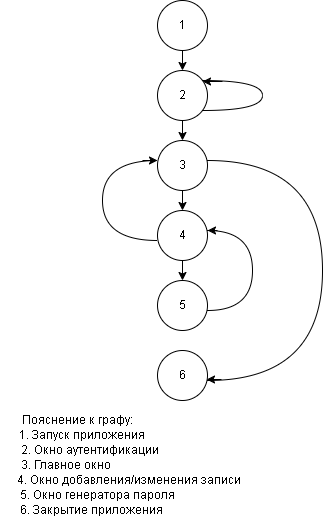

# Тестирование

---

## Модульное тестирование окон приложения

### Таблица 1 – Тест-кейсы модульного тестирования окна аутентификации

| ID | Входные данные               | Последовательность действий                     | Результаты выполнения                                   |
|----|-----------------------------|-----------------------------------------------|--------------------------------------------------------|
| Т1 | Корректный мастер-пароль    | Ввести пароль и нажать «Разблокировать»       | Выполняется успешный вход, открывается MainForm        |
| Т2 | Пустое поле пароля          | Нажать «Разблокировать» без ввода пароля      | Отображается предупреждение о необходимости ввода пароля |
| Т3 | Неверный мастер-пароль      | Ввести неверный пароль и нажать «Разблокировать» | Отображается сообщение об ошибке, поле пароля очищается |
| Т4 | Пароль короче 8 символов    | Ввести короткий пароль и нажать «Создать базу» | Отображается предупреждение о слабом пароле            |
| Т5 | Корректный пароль           | Ввести пароль и нажать «Создать базу»         | Создаётся база данных, открывается MainForm            |

---

### Таблица 2 – Тест-кейсы модульного тестирования главного окна

| ID | Входные данные            | Последовательность действий            | Результаты выполнения                               |
|----|--------------------------|--------------------------------------|----------------------------------------------------|
| Т1 | Запуск приложения        | Запустить приложение                 | Открывается главное окно, отображается список записей |
| Т2 | Нажатие кнопки «Добавить» | Нажать кнопку «Добавить»             | Открывается окно добавления записи                 |
| Т3 | Выделенная запись        | Выделить запись и нажать «Удалить»   | Запись удаляется после подтверждения               |
| Т4 | Выделенная запись        | Выделить запись и нажать «Редактировать» | Открывается окно редактирования записи             |
| Т5 | Нажатие кнопки «Выход»   | Нажать кнопку выхода из приложения    | Приложение корректно закрывается                   |

---

### Таблица 3 – Тест-кейсы модульного тестирования окна добавления/изменения записи

| ID | Входные данные                   | Последовательность действий         | Результаты выполнения                                   |
|----|---------------------------------|-----------------------------------|--------------------------------------------------------|
| Т1 | Пустое поле «Название»          | Нажать «Сохранить»                | Отображается предупреждение, фокус на поле «Название»  |
| Т2 | Заполнено название, пустой пароль | Нажать «Сохранить»                | Отображается предупреждение, фокус на поле «Пароль»    |
| Т3 | Корректные данные               | Заполнить все поля и нажать «Сохранить» | Окно закрывается с DialogResult.OK                     |
| Т4 | Нажатие Enter                   | Ввод данных и нажатие Enter       | Фокус корректно переходит между полями                |
| Т5 | Нажатие «Показать»              | Нажать кнопку показа пароля       | Пароль отображается/скрывается                         |

---

### Таблица 4 – Тест-кейсы модульного тестирования окна генератора пароля

| ID | Входные данные                     | Последовательность действий          | Результаты выполнения                                   |
|----|-----------------------------------|------------------------------------|--------------------------------------------------------|
| Т1 | Значения по умолчанию             | Открыть окно генератора            | Пароль автоматически сгенерирован                       |
| Т2 | Длина пароля = 12                 | Изменить длину пароля              | Генерируется пароль заданной длины                      |
| Т3 | Все типы символов отключены       | Нажать «Сгенерировать»             | Отображается предупреждение, включаются строчные буквы  |
| Т4 | Сгенерированный пароль            | Нажать «Копировать»                | Пароль копируется в буфер обмена                       |
| Т5 | Сгенерированный пароль            | Нажать «Применить»                 | Окно закрывается с DialogResult.OK                     |

---

## Интеграционное тестирование приложения PasswordManager

### Управляющий граф программы

### Основные тестовые пути

Т1: 1 – 2 – 3 – 6  
Т2: 1 – 2 – 2 – 3 – 6  
Т3: 1 – 2 – 3 – 4 – 3 – 6  
Т4: 1 – 2 – 3 – 4 – 5 – 4 – 3 – 6  

---

### Таблица 5 – Тест-кейсы интеграционного тестирования приложения

| Тестируемый путь | Входные данные и последовательность действий | Ожидаемый результат |
|---|------------------|---------------------------------------------|---------------------|
| T1 | Запустить приложение → ввести корректный пароль → нажать «Войти» → в главном окне нажать «Выход» | Успешная авторизация, открытие MainForm, корректное завершение работы |
| T2 | Запустить приложение → ввести неверный пароль → получить ошибку → ввести правильный пароль → выйти из программы | Отображается ошибка при неверном вводе, после правильного пароля открывается MainForm, приложение закрывается корректно |
| T3 | Войти в систему → нажать «Добавить» → ввести сайт, логин, пароль → сохранить → выйти | EntryForm открывается, запись сохраняется, отображается в MainForm, данные записываются в файл |
| T4 | Войти → добавить запись → открыть генератор → сгенерировать пароль → подтвердить → сохранить → выйти | Генератор открывается, пароль передаётся в EntryForm, запись сохраняется и отображается, приложение закрывается без ошибок |

---
